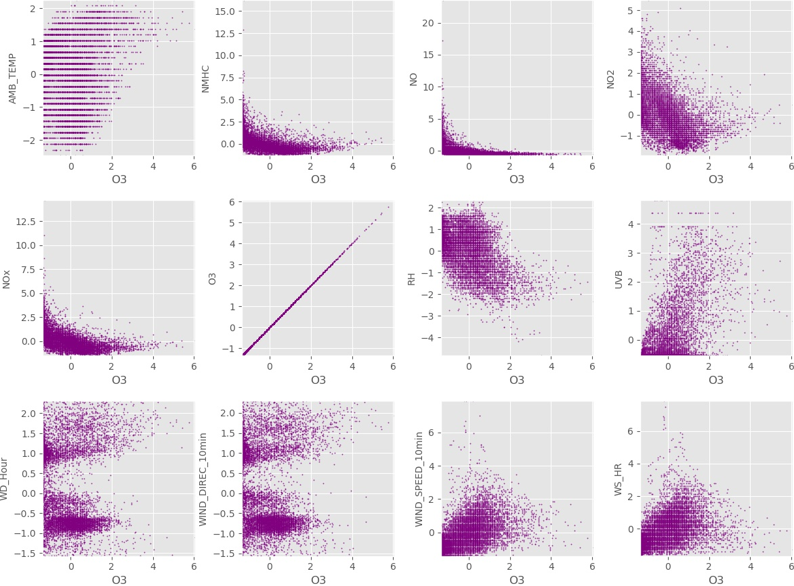
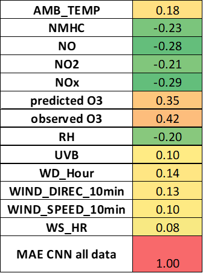
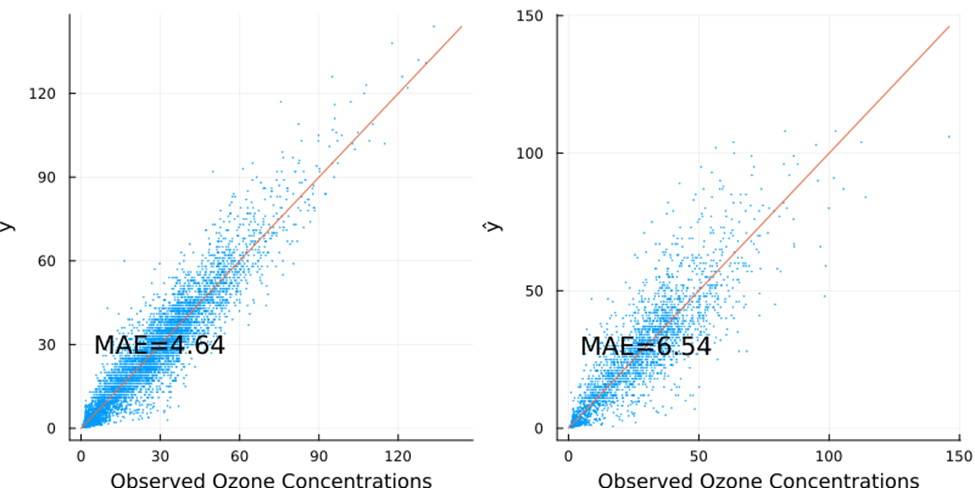
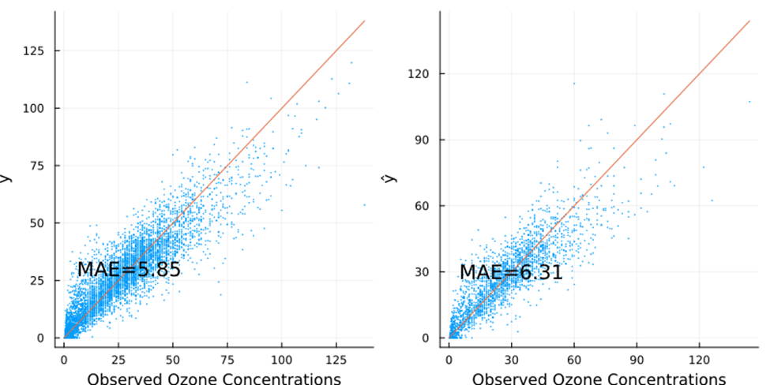

## CEE 492 Final Project Selection 
1. Dataset description:

The dataset used in this project is a `CSV` file about the air quality in northern Taiwan collected in 2015 [https://www.kaggle.com/datasets/nelsonchu/air-quality-in-northern-taiwan], which include air quality data and meteorological monitoring data for research and analysis, originally from Environmental Protection Administration, Executive Yuan, R.O.C. (Taiwan). There are 25 observation stations in total. Columns in this CSV file are the following:

1. Time - The first column is the observation time of 2015

2. Station - The second column is the station name, there are 25 observation stations, those stations are showing at the table @tbl:1.

|  |  | station |  |  |
|:---:|:---:|:---:|:---:|:---:|
| Banqiao | Cailiao | Datong | Dayuan | Guanyin |
| Guting | Keelung | Longtan | Pingzhen | Sanchong |
| Shilin | Songshan | Tamsui | Taoyuan | Tucheng |
| Wanhua | Wanli | Xindian | Xinzhuang | Xizhi |
| Yangming | Yonghe | Zhongli | Zhongshan | Linkou |

Table: A table contain all stations in Taiwan.
{#tbl:1}

3. Items - From the third column to the last one

4. item - `unit` - description
- SO~2~ - `ppb` - Sulfur dioxide
- CO - `ppm` - Carbon monoxide
- O~3~ - `ppb` - ozone
- PM~10~ - `μg/m^3` - Particulate matter
- PM~2.5~ - `μg/m^3` - Particulate matter
- NO~x~ - `ppb`- Nitrogen oxides
- NO - `ppb` - Nitric oxide
- NO~2~ - `ppb` - Nitrogen dioxide
- THC - `ppm` - Total Hydrocarbons
- NMHC - `ppm` - Non-Methane Hydrocarbon
- CH4 - `ppm` - Methane
- UVB - `UVI` - Ultraviolet index
- AMB_TEMP - `Celsius` - Ambient air temperature
- RAINFALL - `mm`
- RH - `%` - Relative humidity
- WIND_SPEED - `m/sec` - The average of the last ten minutes per hour
- WIND_DIREC - `degrees` - The average of the last ten minutes per hour
- WS_HR - `m/sec` - The average of an hour
- WD_HR - `degrees` - The average of an hour
- PH_RAIN - `PH` - Acid rain
- RAIN_COND - `μS/cm` - Conductivity of acid rain

## Proposal:
The purpose of this project is to predict O~3~ concentrations using measurements of concentration of other pollutants and available meteorological measurements.  Ozone might be formed when heat and sunlight cause chemical reactions between oxides of nitrogen (NO~x~) and Volatile Organic Compounds (VOC), which are also known as Hydrocarbons. Therefore it could be hypothesized that using measurements of NO~x~ as an independent variable a model could be developed to predict O~3~ concentrations. Additionally, meteorological variables such as air temperature, relative humidity(RH) and ultraviolet index (UVB - UVI) could be included as independent variables to assess their influence on temporal variability of ozone. As an additional step wind-related variables such as mean wind velocity and direction will be included to study their effect on temporal variability of ozone.

After the air quality data has been processed the strongest O~3~ predictors will be determined using PCA. PCA could be used to identify the main axes of variance within the dataset and explore underlying correlations that exist in a set of variables. Variables that are highly correlated cluster together. Using PCA 2D figures per each pair of variables are not needed, instead all the variables could be visualized simultaneously. Differences on PC1 are more important than differences on PC2. After plotting PCA plots, a heatmap could also be plotted to check the results. As additional criteria to identify the strongest predictors a LSTM network (long short-term memory network) can be used since the data used is time dependent. The network should contain several LSTM layers and fully-connected layers. The output should contain the pollution concentration and will point out the weights assigned to each correlated criterion, the values of such weights should also indicate what the strongest predictors are. Once the strongest predictors have been identified, genetic programming will be used to develop the models to predict O~3~ concentrations. 

## Exploratory Data Analysis:

In order to explore the relation between the dependent variable and independent variables several scatter plots were created between meteorological variables, pollutant concentrations and ozone concentrations. Additionally, a heatmap was generated to investigate the correlation values between ozone concentration and independent variables. The most correlated variables are RH(relative humidity) and UVB(Ultraviolet index). RH is negatively correlated with ozone,value of -0.51, while UVB is positively correlated, value of 0.51. Another relevant observation was that concentrations of nitrogen-related chemicals are highly correlated between each other, which is close to the truth. 

{#fig:heatmap width=6in}

Furthermore, the fraction of available measurements, meaning the number of data points available divided by the number of hours in a year, was computed for all stations and all measured variables. This computation helped visualize the stations that missed the least data points as well as the variables whose values are recorded the most consistently through different stations. The station with the highest fraction of available measurements was Banquiao, as seen in the Figure @fig:var. For this reason the remaining portion of this EDA was devoted to this station.

{#fig:var width=6in}

Other relevant statistics from the Banquio air quality station are shown as Table @tbl:2. 

|                      | **count** | **mean**  | **std** | **min** | **25%** | **50%** | **75%** | **max** |
|----------------------|-----------|-----------|---------|---------|---------|---------|---------|---------|
| **AMB_TEMP**         | 8682      | 1.18E-15  | 1.00    | -2.47   | -0.89   | 0.15    | 0.68    | 2.25    |
| **NMHC**             | 8619      | -4.74E-15 | 1.00    | -1.32   | -0.62   | -0.30   | 0.29    | 16.26   |
| **NO**               | 8462      | 3.20E-15  | 1.00    | -0.75   | -0.50   | -0.32   | 0.05    | 23.55   |
| **NO2**              | 8462      | 1.56E-15  | 1.00    | -1.94   | -0.78   | -0.10   | 0.57    | 5.48    |
| **NOx**              | 8462      | 1.62E-15  | 1.00    | -1.54   | -0.69   | -0.20   | 0.42    | 14.67   |
| **O3**               | 8685      | -8.78E-16 | 1.00    | -1.35   | -0.80   | -0.07   | 0.54    | 6.06    |
| **RH**               | 8684      | -1.56E-15 | 1.00    | -4.85   | -0.75   | 0.17    | 0.76    | 2.35    |
| **UVB**              | 8684      | 3.53E-15  | 1.00    | -0.56   | -0.56   | -0.56   | 0.12    | 4.81    |
| **WD_Hour**          | 8680      | 2.64E-16  | 1.00    | -1.58   | -0.78   | -0.59   | 1.01    | 2.32    |
| **WIND_DIREC_10min** | 8682      | 6.96E-16  | 1.00    | -1.56   | -0.78   | -0.58   | 1.01    | 2.31    |
| **WIND_SPEED_10min** | 8682      | -6.21E-15 | 1.00    | -1.43   | -0.72   | -0.18   | 0.53    | 7.92    |
| **WS_HR**            | 8680      | -2.83E-15 | 1.00    | -1.67   | -0.80   | -0.12   | 0.56    | 7.86    |

Table:Descriptive statistics of features that compose in Banqiao Station 
{#tbl:2}

As described in previous sections, the dataset consists of hourly observations of ozone (dependent variable) and several pollutant concentrations and meteorological measurements (independent variables). The first step was to plot ozone against all of the independent variables to visualize if the data collapsed into any identifiable pattern, thus to later on use such a pattern to identify potential models. The measurements in an hourly time scale did not show any discernible pattern between the dependent and independent variables.  As seen in figure @fig:O31.

{#fig:O31 width=6in}

Plotting the raw data, i.e. the available measurements without any processing or transformation, did not yield any insights that could help elucidate the relation between the variables. Therefore, the data was normalized. Notwithstanding,  normalization did not translate into plots where patterns could be identified. Thus, the data was processed again following two consecutive steps. First the values were averaged over a day and over a month producing a dataset of daily and monthly measurement. Second, such values were standardized by dividing them by the corresponding daily and monthly averages.

The resulting daily and monthly standardized averages were plotted against time. Plotting the daily averaged variables shown plots where the fluctuations of the values happened in a relatively short time and thus such fluctuations obscured any pattern that could be observed in the data, as seen in the next figure. Conversely, when the monthly standardized averages were plotted against time it was visible that the pollutants concentrations shown similar time patterns as seen in figures @fig:day.

{#fig:day width=6in}

{#fig:Pollutants width=6in}

{#fig:MetereologicalVars width=6in}

In regards to pollutant concentrations, O3 peaked in the months when concentration of the nitrogen based pollutants and non-methane hydrocarbons dropped. This is especially the case for NO concentrations (green line). This pattern of corresponding decreasing pollutant concentrations and increasing ozone could suggest that the pollutant concentrations are negatively correlated with ozone concentrations. This is also consistent with figure @fig:Pollutants (correlation plot)

In regards to the meteorological variables, UVB (ultraviolet index) and air temperature peak in the same months. Both temperature and UVB experience an increase in their values from the beginning of the year peaking in June. After June, both values experience a steady decrease. No matching pattern can be observed in terms of the relation of the latter two variables and ozone concentrations. 

The increase or decrease of the values of wind direction shown in figure @fig:MetereologicalVars correspond to a relative shift in direction of the wind compared to the yearly wind direction. These shifts in the direction of the wind can be used later on the forecasting of O3 concentration. Wind direction could help elucidate if O3 concentration from upwind neighboring locations could affect O3 values in the location of interest, Banquiao. 

## Predictive Modeling

### Selection of neural network model

Different configurations of neural networks where used: fully connected layers, here called NN for simplicity, convolutional neural networks (CNN), and long short-term memory (LSTM). 

{#fig:NN_RMSE=6in}

A convolutional neural network (CNN) was also tested. The CNN had 8 layers with 18 neurons each. Relu was used as activation function. The number of epochs used was 100 with η = 0.01. RMSE of CNN was 8.63 and mean average error (MAE) was 5.85, for reference the best preforming NN, hereafter called NN 8-L, had a RSME of 6.7 and a MAE of 4.64 for the training dataset.

When comparing the performance of models on the testing dataset, NN 8-L had a MAE value of 6.54 on compared to a lower 6.31 MAE when using the CNN. This higher error might indicate that the NN overfitted  the training data. It is necessary to mention the training times of the NN and CNN. The NN needed approximately 10 minutes for training whereas the CNN required close to 3 minutes. Clearly this is due to the number of epochs used on training NN 8-L. However, when training the CNN during 300 epochs MAE did not drop below 5.8.  Thus the original number of epochs was used.

To summarize, the NN 8-L surpass the performance of CNN when measuring the RMSE of the training dataset. Yet, with a significantly lower number of epochs and processing times similar values of MAE were achieved using the CNN. Moreover, with limited training CNN outperform NN-8L on the testing dataset which might indicate greater ability of the CNN model to  generalize and not overfit the data used on training. The latter argument clearly would be better supported via further testing with new data. If corroborated, CNN would be in consequence the most suitable model since generalization is of prime importance for regression models.

{#fig:NN_Train_Test width=6in}

{#fig:NN_Train_Test width=6in}

### Error model

#### Correlation of measured variables and error

It is noticeable that correlation values are below 0.5 which might suggest that the relationship between predictand (error) and each of the potential predictors is non-linear. To measure error the MAE formula was used comparing observed ozone concentration and output of the CNN model. MAE was used for consistency since this formula was used during CNN training.

{#fig:Cor_error width=6in}

Error and observed and predicted ozone concentration have the highest positive correlations. This might indicate that error is more pronounced for higher values of ozone concentration. Highest negative correlation was observed between error, nitrogen species and RH. This in turn could indicate that higher concentrations of these chemicals, or higher values of relative humidity, might translate into smaller error values. 

### Modeling prediction error

Preliminary efforts were conducted to model error as a function of nitrogen species, RH and predicted O3. The same neural network configuration as the original CNN model was used. This decision was based on significant lower training times, approx. 2 minutes compared to 8 minutes of an NN with similar configuration. Data was normalized prior to model training and testing.

MAE of the error model was 3.8 after 100 epochs with a learning rate of 0.005. Increasing the number of epochs on training did not translate in further reduction of MAE. Recall that CNN MAE error is 6.31, thus MAE = 3.8 on the error model is not satisfactory. 

### Additional avenues of improvement

The current modeling effort might indicate that ozone concentrations might not be predicted with lower error values using the available dataset. Thus repurposing of the modeling effort towards a more error tolerant goal might be an alternative to yield utility from the available dataset. For instance, the available dataset could be used for a binary classification model to predict if ozone levels are above or below 70 ppb. The aforementioned value is the threshold of the primary (public health) and secondary (public welfare) 8-hour ozone standards defined by the “2015 Revision to 2008 Ozone National Ambient Air Quality Standards (NAAQS) Related Documents” 

