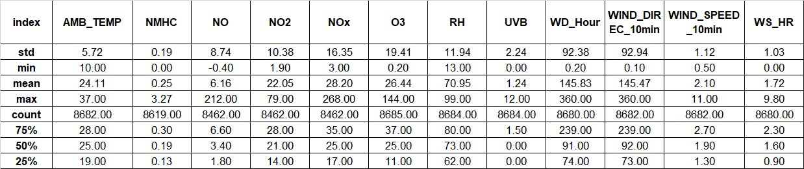
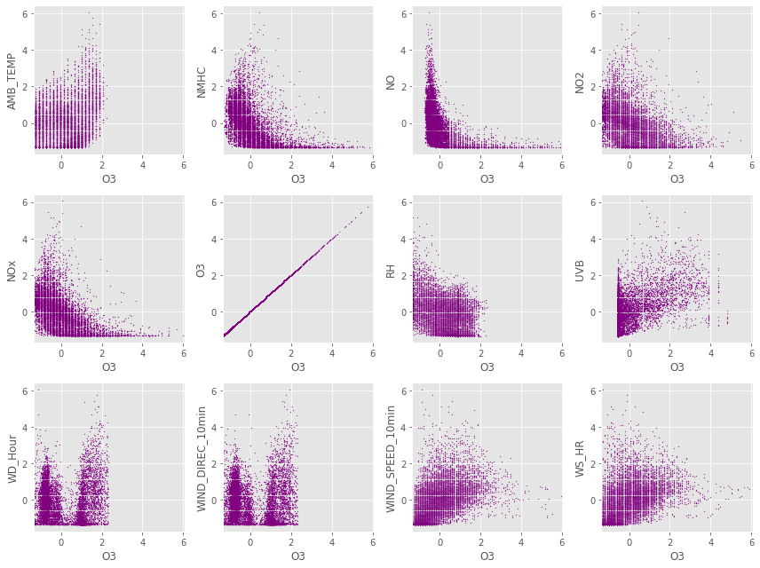
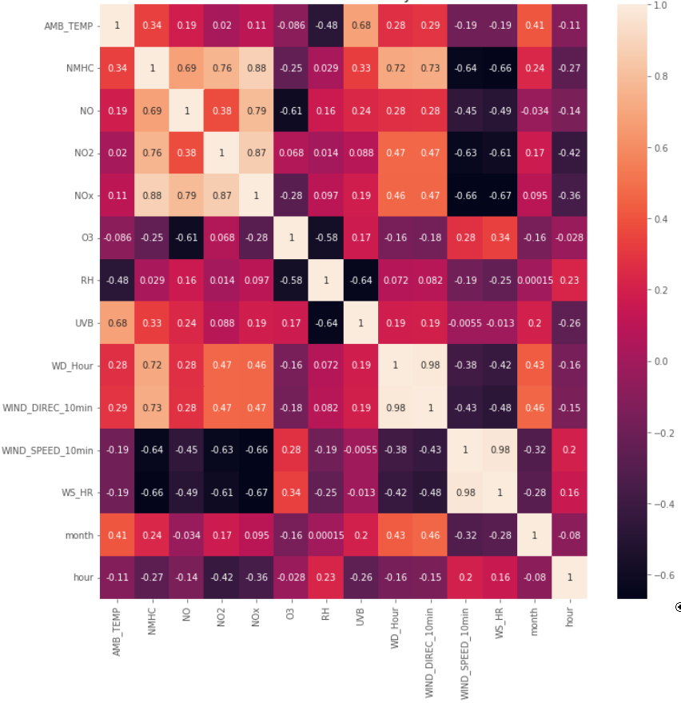
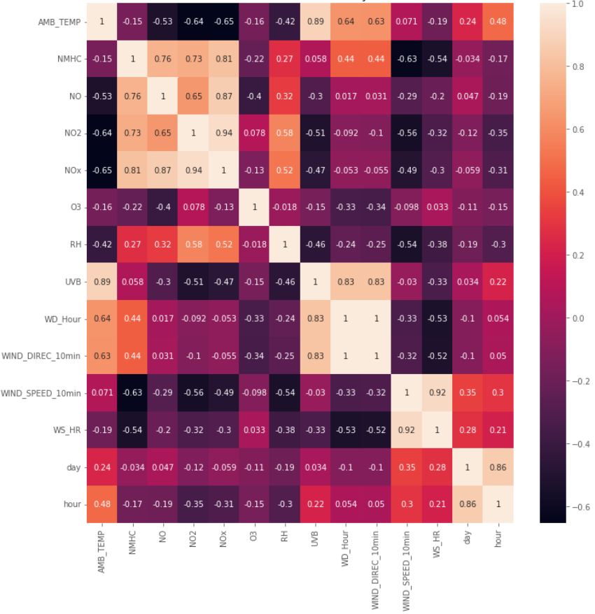
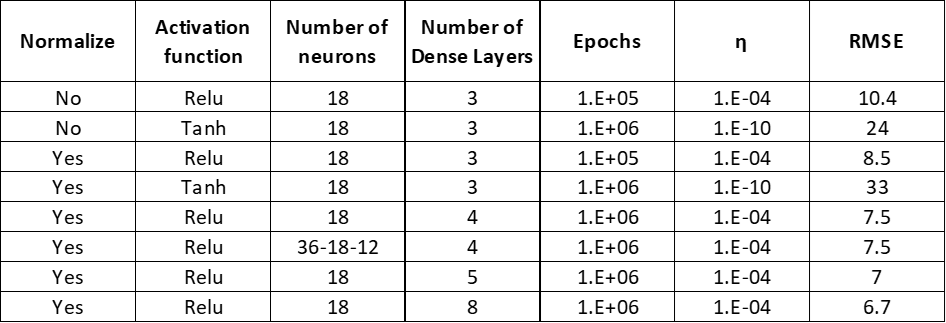
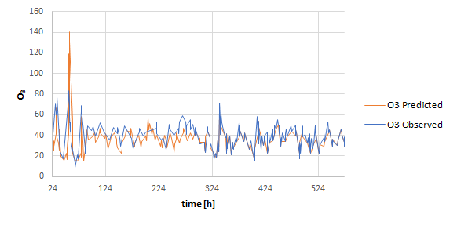

---
title: Forecasting and time variability analysis of Ozone concentrations using nitrate oxide and meteorological variables as predictors
keywords:
- markdown
- publishing
- manubot
lang: en-US
date-meta: '2022-12-02'
author-meta:
- Jiewen Luo
- Rourou Ji
- Bernardo Burbano
header-includes: |-
  <!--
  Manubot generated metadata rendered from header-includes-template.html.
  Suggest improvements at https://github.com/manubot/manubot/blob/main/manubot/process/header-includes-template.html
  -->
  <meta name="dc.format" content="text/html" />
  <meta name="dc.title" content="Forecasting and time variability analysis of Ozone concentrations using nitrate oxide and meteorological variables as predictors" />
  <meta name="citation_title" content="Forecasting and time variability analysis of Ozone concentrations using nitrate oxide and meteorological variables as predictors" />
  <meta property="og:title" content="Forecasting and time variability analysis of Ozone concentrations using nitrate oxide and meteorological variables as predictors" />
  <meta property="twitter:title" content="Forecasting and time variability analysis of Ozone concentrations using nitrate oxide and meteorological variables as predictors" />
  <meta name="dc.date" content="2022-12-02" />
  <meta name="citation_publication_date" content="2022-12-02" />
  <meta name="dc.language" content="en-US" />
  <meta name="citation_language" content="en-US" />
  <meta name="dc.relation.ispartof" content="Manubot" />
  <meta name="dc.publisher" content="Manubot" />
  <meta name="citation_journal_title" content="Manubot" />
  <meta name="citation_technical_report_institution" content="Manubot" />
  <meta name="citation_author" content="Jiewen Luo" />
  <meta name="citation_author_institution" content="Department of CEE, University of Illinois at Urbana&amp;Champaign" />
  <meta name="citation_author" content="Rourou Ji" />
  <meta name="citation_author_institution" content="Department of CEE, University of Illinois at Urbana&amp;Champaign" />
  <meta name="citation_author" content="Bernardo Burbano" />
  <meta name="citation_author_institution" content="Department of CEE, University of Illinois at Urbana&amp;Champaign" />
  <link rel="canonical" href="https://uiceds.github.io/cee-492-term-project-fall-2022-hydrograds/" />
  <meta property="og:url" content="https://uiceds.github.io/cee-492-term-project-fall-2022-hydrograds/" />
  <meta property="twitter:url" content="https://uiceds.github.io/cee-492-term-project-fall-2022-hydrograds/" />
  <meta name="citation_fulltext_html_url" content="https://uiceds.github.io/cee-492-term-project-fall-2022-hydrograds/" />
  <meta name="citation_pdf_url" content="https://uiceds.github.io/cee-492-term-project-fall-2022-hydrograds/manuscript.pdf" />
  <link rel="alternate" type="application/pdf" href="https://uiceds.github.io/cee-492-term-project-fall-2022-hydrograds/manuscript.pdf" />
  <link rel="alternate" type="text/html" href="https://uiceds.github.io/cee-492-term-project-fall-2022-hydrograds/v/13298fa66ac6cef8486f8262567a6dc43b424303/" />
  <meta name="manubot_html_url_versioned" content="https://uiceds.github.io/cee-492-term-project-fall-2022-hydrograds/v/13298fa66ac6cef8486f8262567a6dc43b424303/" />
  <meta name="manubot_pdf_url_versioned" content="https://uiceds.github.io/cee-492-term-project-fall-2022-hydrograds/v/13298fa66ac6cef8486f8262567a6dc43b424303/manuscript.pdf" />
  <meta property="og:type" content="article" />
  <meta property="twitter:card" content="summary_large_image" />
  <link rel="icon" type="image/png" sizes="192x192" href="https://manubot.org/favicon-192x192.png" />
  <link rel="mask-icon" href="https://manubot.org/safari-pinned-tab.svg" color="#ad1457" />
  <meta name="theme-color" content="#ad1457" />
  <!-- end Manubot generated metadata -->
bibliography:
- content/manual-references.json
manubot-output-bibliography: output/references.json
manubot-output-citekeys: output/citations.tsv
manubot-requests-cache-path: ci/cache/requests-cache
manubot-clear-requests-cache: false
...

<small><em>
This manuscript
([permalink](https://uiceds.github.io/cee-492-term-project-fall-2022-hydrograds/v/13298fa66ac6cef8486f8262567a6dc43b424303/))
was automatically generated
from [uiceds/cee-492-term-project-fall-2022-hydrograds@13298fa](https://github.com/uiceds/cee-492-term-project-fall-2022-hydrograds/tree/13298fa66ac6cef8486f8262567a6dc43b424303)
on December 2, 2022.
</em></small>

## Authors

+ **Jiewen Luo** 
    · {.inline_icon}
    [Noomi-Luo](https://github.com/Noomi-Luo) 
  <small>
     Department of CEE, University of Illinois at Urbana&Champaign
  </small>

+ **Rourou Ji** 
    · {.inline_icon}
    [JadeJi](https://github.com/JadeJi) 
  <small>
     Department of CEE, University of Illinois at Urbana&Champaign
  </small>

+ **Bernardo Burbano** 
    · {.inline_icon}
    [BernieJBA](https://github.com/BernieJBA) 
  <small>
     Department of CEE, University of Illinois at Urbana&Champaign
  </small>

## Forecasting and Time Variability Analysis of Ozone Concentrations Using Nitrogen Oxide and Meteorological Variables as Predictors 
Bernardo Burbano, Jiewen Luo, Rourou Ji

## Introduction
The purpose of this project is to predict O~3~ concentrations using measurements of concentration of other pollutants and available meteorological measurements.  Ozone might be formed when heat and sunlight cause chemical reactions between oxides of nitrogen (NO~x~) and Volatile Organic Compounds (VOC), which are also known as Hydrocarbons. Therefore it could be hypothesized that using measurements of NO~x~ as an independent variable a model could be developed to predict O~3~ concentrations. Additionally, meteorological variables such as air temperature, relative humidity(RH) and ultraviolet index (UVB - UVI) could be included as independent variables to assess their influence on temporal variability of ozone. As an additional step wind-related variables such as mean wind velocity and direction will be included to study their effect on temporal variability of ozone, too.

The dataset used in this project is a CSV file about the air quality in northern Taiwan collected in 2015 [https://www.kaggle.com/datasets/nelsonchu/air-quality-in-northern-taiwan], which includes air quality data and meteorological monitoring data for research and analysis, originally from Environmental Protection Administration, Executive Yuan, R.O.C. (Taiwan). There are 25 observation stations in total. Columns in this CSV file are the following:

Time - The first column is the observation time of 2015

Station - The second column is the station name, there are 25 observation stations, those stations are showing at the Table 1 .

Items - From the third column to the last one

item - unit - description

SO2 - ppb - Sulfur dioxide

CO - ppm - Carbon monoxide

O3 - ppb - ozone

PM10 - μg/m^3 - Particulate matter

PM2.5 - μg/m^3 - Particulate matter

NOx - ppb- Nitrogen oxides

NO - ppb - Nitric oxide

NO2 - ppb - Nitrogen dioxide

THC - ppm - Total Hydrocarbons

NMHC - ppm - Non-Methane Hydrocarbon

CH4 - ppm - Methane

UVB - UVI - Ultraviolet index

AMB_TEMP - Celsius - Ambient air temperature

RAINFALL - mm

RH - % - Relative humidity

WIND_SPEED - m/sec - The average of the last ten minutes per hour

WIND_DIREC - degrees - The average of the last ten minutes per hour

WS_HR - m/sec - The average of an hour

WD_HR - degrees - The average of an hour

PH_RAIN - PH - Acid rain

RAIN_COND - μS/cm - Conductivity of acid rain

Table 1: A table contain all stations in Taiwan. 
|  |  | station |  |  |
|:---:|:---:|:---:|:---:|:---:|
| Banqiao | Cailiao | Datong | Dayuan | Guanyin |
| Guting | Keelung | Longtan | Pingzhen | Sanchong |
| Shilin | Songshan | Tamsui | Taoyuan | Tucheng |
| Wanhua | Wanli | Xindian | Xinzhuang | Xizhi |
| Yangming | Yonghe | Zhongli | Zhongshan | Linkou |

After the air quality data has been processed, the strongest O~3~ predictors will be determined by using a heatmap. The neural network and convolutional neural network are performed to predict hourly concentrations of O~3~. As additional criteria to identify the strongest predictors, a LSTM network (long short-term memory network) can be used since the data used is time dependent. Several LSTM layers and fully-connected layers are included in this method. Then the pollution concentrations and the weights assigned to each correlated criterion that indicate the strongest predictors could be investigated. Once the strongest predictors have been identified, genetic programming will be used to develop the models to predict O~3~ concentrations. 

## Exploratory Data Analysis

In order to explore the relation between the dependent variable and independent variables several scatter plots were created between meteorological variables, pollutant concentrations and ozone concentrations. Additionally, a heatmap was generated to investigate the correlation values between ozone concentration and independent variables. The most correlated variables are RH(relative humidity) and UVB(Ultraviolet index). RH is negatively correlated with ozone,value of -0.51, while UVB is positively correlated, value of 0.51. Another relevant observation was that concentrations of nitrogen-related chemicals are highly correlated between each other, which is close to the truth. 

Figure 1: Heatmap of Correlation Matrix for Hourly Values

Furthermore, the fraction of available measurements, meaning the number of data points available divided by the number of hours in a year, was computed for all stations and all measured variables. This computation helped visualize the stations that missed the least data points as well as the variables whose values are recorded the most consistently through different stations. The station with the highest fraction of available measurements was Banquiao, as seen in the Figure @fig:var. For this reason the remaining portion of this EDA was devoted to this station. Other relevant statistics from the Banquio air quality station are shown in the following Table. 

Figure 2: 

Table 2: Statistics of Air Quality and Relevant Meteorological Variables From Banqiao Station

{#fig:var width=6in}

As described in previous sections, the dataset consists of hourly observations of ozone (dependent variable) and several pollutant concentrations and meteorological measurements (independent variables). The first step is to plot ozone against all of the independent variables to visualize if the data collapsed into any identifiable pattern, thus to later on use such a pattern to identify potential models. The measurements in an hourly time scale did not show any discernible pattern between the dependent and independent variables as shown in Figure 3.

Figure 3: Correlationships Between Each Parameter

Plotting the raw data, i.e. the available measurements without any processing or transformation, did not yield any insights that could help elucidate the relation between the variables. Therefore, the data was normalized. Notwithstanding,  normalization did not translate into plots where patterns could be identified. Thus, the data was processed again following two consecutive steps. First the values were averaged over a day and over a month producing a dataset of daily and monthly measurement. Second, such values were standardized by dividing them by the corresponding daily and monthly averages.

The resulting daily and monthly standardized averages were plotted against time. Plotting the daily averaged variables shown plots where the fluctuations of the values happened in a relatively short time and thus such fluctuations obscured any pattern that could be observed in the data, as seen in the next figure. Conversely, when the monthly standardized averages were plotted against time it was visible that the pollutants concentrations shown similar time patterns as seen in Figure 5.

{#fig:day width=6in}

Figure 4: Daily Concentration of Ozone

{#fig:Pollutants width=6in}

Figure 5: Standardized Pollutions and Ozone Monthly Concentration Changes

{#fig:MetereologicalVars width=6in}

Figure 6: Standarized Meteorological Measurements and Standardized Ozone Monthly Concentration Changes

In regards to pollutant concentrations, O3 peaked in the months when concentration of the nitrogen based pollutants and non-methane hydrocarbons dropped. This is especially the case for NO concentrations (green line). This pattern of corresponding decreasing pollutant concentrations and increasing ozone could suggest that the pollutant concentrations are negatively correlated with ozone concentrations. This is also consistent with figure @fig:heatmap (correlation plot). As shown in the figure correlation values for the nitrogen species are negative and vary from -0.41 to -0.5. 

In regards to the meteorological variables, UVB (ultraviolet index) and air temperature peak in the same months. Both temperature and UVB experience an increase in their values from the beginning of the year peaking in June. After June, both values experience a steady decrease. In the case of UVB a correlation of 0.51 can be observed in @fig:heatmap.

{#fig:heatmap_d width=6in}

Figure 7: Correlation Matrix for Daily Values

{#fig:heatmap_m width=6in}

Figure 8: Correlation Matrix for Monthly Values

## Predictive Modeling

Two additional correlation matrices were produced. One for monthly average values and another for daily average values. As observed in all three heatmaps, correlation values of ozone with respect to hourly and monthly values of nitrogen-containing compounds, NMHC and temperature are generally lower compared to correlations values of hourly measurements. Thus, the hourly measurements will be used for predictive modeling.

The low values of the coefficient of determination (r2) between O3 and each of the other variables suggest non-linear relations. Considering the non-linearity of the relation between the predictand O3 and the potential predictors a neural network seems suitable to develop the predictive model. Three different types of neural networks will be tested along with different values of hyperparameters.  

### Predictive model 

Different configurations of neural networks were used, fully connected layers, hereafter called NN for simplicity and convolutional neural networks (CNN). Both neural networks were used to predict hourly concentrations of O_3 (predictand) using as predictors the most correlated variables found in the EDA. The variables use as predictors were hourly meassurements of: relative humidity (RH), ultraviolet radiation (UVB rays), NMHC, NOx, NO and NO2. 

In the case of the NNs, different numbers of layers, neurons and activation functions were tested. As seen in Table 3, the lowest root mean square error achieved was 6.7 PPM using an 18 neuron 8 layer NN architecture with 1E6 epochs and a learning rate (η) of 1E-4. 

Two CNN were also tested. A CNN with 8 fully connected layers of 18 neurons with Relu activation function and a second CNN with one convolution layer of 64 neurons and two fully connected layers with Relu activation function. The two CNNs were trained with 1E3 epochs and η = 1E-4. The corresponding RMSEs were 8.63 PPB and 6.26 PPB. All the error values were calculated using the testing data i.e. the 30% held out fraction of available observations. 

For reference, the mean value of ozone concentration in the dataset was 25.0 PPB. Considering  the lowest RMSE measured in all the different NN and CNN model was 6.26 PPB, the level of error of the predictive model might be deemed unsatisfactory.  This motivated to test another neural network configuration: long-short term memory neural network. The latter is often used to model sequential data, thus instead of a predictive model a forecast model was developed.

Table 3: RMSE Values for Different Hyperparameters and NN Configurations
{#fig:NN_RMSE=6in}

### Forecast model

Long short-term memory neural networks were use to forecast hourly concentrations of O_3 (predictand) using hourly measurements recorded on the previous 5 hours of different variables. The variables used were: relative humidity (RH), ultraviolet radiation (UVB rays), NMHC, NOx, NO and NO2 and ambient temperature. 

#### Long short-term memory neural networks (LSTMs)

In order to explain the utility of LSTMs a drawback of CNNs have to be discussed. Convolutional neural networks (CNN) use filters to extend the depth of the input volume. One drawback of CNN is that its gradients can explode or vanish which may restrict neural network performance. Long short-term memory use two path for long (cell state) and short memories (hidden state) to avoid the exploding/vanishing gradient problem. LSTM has three gates that determined the output: forget gate to determine the percentage of long-term memory that is remembered via a Sigmoid function; input gate to calculate both the potential memory using a Tanh function and the percentage of potential memory that is remembered; and a third gate, called the output gate, to multiply a Tanh function with the long term memory results to obtain the output. 

The LSTM tested had one 32 neuron layer, a second 64 neuron layer followed by two dense layers of 8 and 1 neuron, and Relu as activation function. LSTM training was done with hourly measurements from the previous 5 hours to forecast ozone concentration of the 6th hour. RMSE for LSTM on the testing data was 1.76. The following plots shows predicted O3 values with LSTM and observed O3 values.

{#fig:LSTM_observed=4in}

Figure 9: Predicted and Observed Ozone Concentrations by LSTM Method

### Additional avenues of improvement

The current modeling effort might indicate that ozone concentrations might not be predicted with lower error values using the available dataset. Thus repurposing of the modeling effort towards a more error tolerant goal might be an alternative to yield further utility from the available dataset. For instance, the available dataset could be used for a binary classification model to predict if ozone levels are above or below 70 ppb. The aforementioned value is the threshold of the primary (public health) and secondary (public welfare) 8-hour ozone standards defined by the “2015 Revision to 2008 Ozone National Ambient Air Quality Standards (NAAQS) Related Documents” 

### Discussion

## References {.page_break_before}

<!-- Explicitly insert bibliography here -->

Reference:
https://machinelearningmastery.com/return-sequences-and-return-states-for-lstms-in-keras/

https://machinelearningmastery.com/stacked-long-short-term-memory-networks/

https://en.wikipedia.org/wiki/Convolutional_neural_network#Convolutional_layer

https://www.youtube.com/watch?v=YCzL96nL7j0 "Long Short-Term Memory (LSTM), Clearly Explained"

https://www.youtube.com/watch?v=kGdbPnMCdOg  "Multivariate Time Series Forecasting Using LSTM, GRU & 1d CNNs"

https://github.com/Dana2021/CEE498DS-Project1 

https://blog.csdn.net/bryan__/article/details/51607215 "Introduce several common feature selection methods in conjunction with Scikit-learn"
