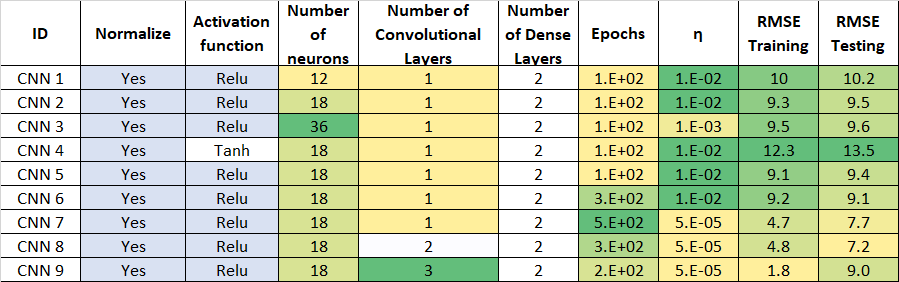
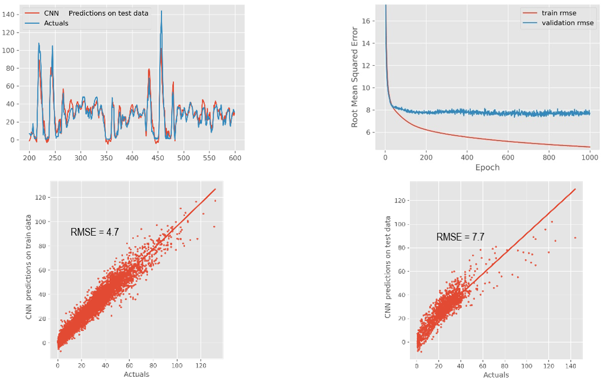
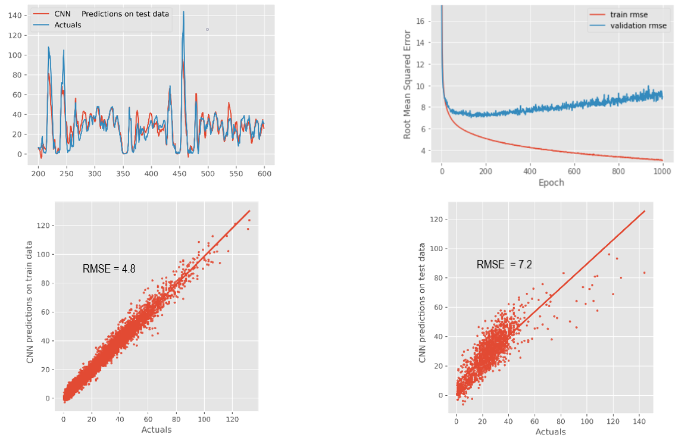
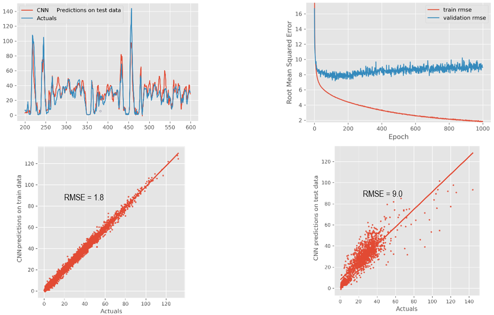
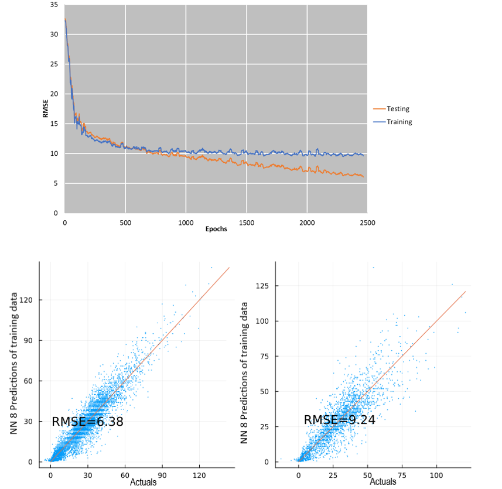
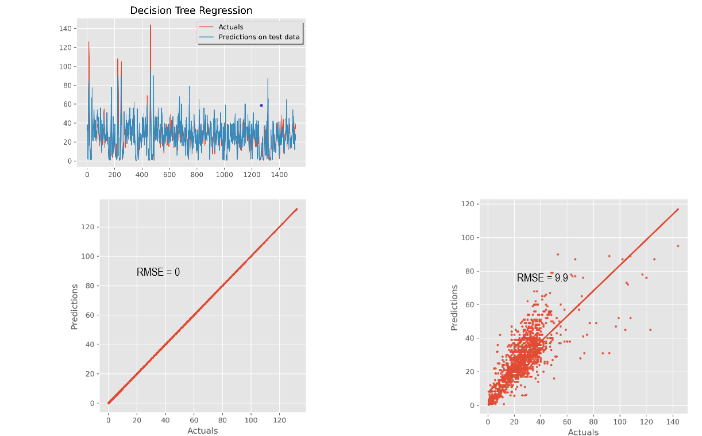

---
title: Forecasting and time variability analysis of Ozone concentrations using nitrate oxide and meteorological variables as predictors
keywords:
- markdown
- publishing
- manubot
lang: en-US
date-meta: '2022-12-04'
author-meta:
- Jiewen Luo
- Rourou Ji
- Bernardo Burbano
header-includes: |-
  <!--
  Manubot generated metadata rendered from header-includes-template.html.
  Suggest improvements at https://github.com/manubot/manubot/blob/main/manubot/process/header-includes-template.html
  -->
  <meta name="dc.format" content="text/html" />
  <meta name="dc.title" content="Forecasting and time variability analysis of Ozone concentrations using nitrate oxide and meteorological variables as predictors" />
  <meta name="citation_title" content="Forecasting and time variability analysis of Ozone concentrations using nitrate oxide and meteorological variables as predictors" />
  <meta property="og:title" content="Forecasting and time variability analysis of Ozone concentrations using nitrate oxide and meteorological variables as predictors" />
  <meta property="twitter:title" content="Forecasting and time variability analysis of Ozone concentrations using nitrate oxide and meteorological variables as predictors" />
  <meta name="dc.date" content="2022-12-04" />
  <meta name="citation_publication_date" content="2022-12-04" />
  <meta name="dc.language" content="en-US" />
  <meta name="citation_language" content="en-US" />
  <meta name="dc.relation.ispartof" content="Manubot" />
  <meta name="dc.publisher" content="Manubot" />
  <meta name="citation_journal_title" content="Manubot" />
  <meta name="citation_technical_report_institution" content="Manubot" />
  <meta name="citation_author" content="Jiewen Luo" />
  <meta name="citation_author_institution" content="Department of CEE, University of Illinois at Urbana&amp;Champaign" />
  <meta name="citation_author" content="Rourou Ji" />
  <meta name="citation_author_institution" content="Department of CEE, University of Illinois at Urbana&amp;Champaign" />
  <meta name="citation_author" content="Bernardo Burbano" />
  <meta name="citation_author_institution" content="Department of CEE, University of Illinois at Urbana&amp;Champaign" />
  <link rel="canonical" href="https://uiceds.github.io/cee-492-term-project-fall-2022-hydrograds/" />
  <meta property="og:url" content="https://uiceds.github.io/cee-492-term-project-fall-2022-hydrograds/" />
  <meta property="twitter:url" content="https://uiceds.github.io/cee-492-term-project-fall-2022-hydrograds/" />
  <meta name="citation_fulltext_html_url" content="https://uiceds.github.io/cee-492-term-project-fall-2022-hydrograds/" />
  <meta name="citation_pdf_url" content="https://uiceds.github.io/cee-492-term-project-fall-2022-hydrograds/manuscript.pdf" />
  <link rel="alternate" type="application/pdf" href="https://uiceds.github.io/cee-492-term-project-fall-2022-hydrograds/manuscript.pdf" />
  <link rel="alternate" type="text/html" href="https://uiceds.github.io/cee-492-term-project-fall-2022-hydrograds/v/6a3265e98a2146498a29611d748cb21abedf8db3/" />
  <meta name="manubot_html_url_versioned" content="https://uiceds.github.io/cee-492-term-project-fall-2022-hydrograds/v/6a3265e98a2146498a29611d748cb21abedf8db3/" />
  <meta name="manubot_pdf_url_versioned" content="https://uiceds.github.io/cee-492-term-project-fall-2022-hydrograds/v/6a3265e98a2146498a29611d748cb21abedf8db3/manuscript.pdf" />
  <meta property="og:type" content="article" />
  <meta property="twitter:card" content="summary_large_image" />
  <link rel="icon" type="image/png" sizes="192x192" href="https://manubot.org/favicon-192x192.png" />
  <link rel="mask-icon" href="https://manubot.org/safari-pinned-tab.svg" color="#ad1457" />
  <meta name="theme-color" content="#ad1457" />
  <!-- end Manubot generated metadata -->
bibliography:
- content/manual-references.json
manubot-output-bibliography: output/references.json
manubot-output-citekeys: output/citations.tsv
manubot-requests-cache-path: ci/cache/requests-cache
manubot-clear-requests-cache: false
...

<small><em>
This manuscript
([permalink](https://uiceds.github.io/cee-492-term-project-fall-2022-hydrograds/v/6a3265e98a2146498a29611d748cb21abedf8db3/))
was automatically generated
from [uiceds/cee-492-term-project-fall-2022-hydrograds@6a3265e](https://github.com/uiceds/cee-492-term-project-fall-2022-hydrograds/tree/6a3265e98a2146498a29611d748cb21abedf8db3)
on December 4, 2022.
</em></small>

## Authors

+ **Jiewen Luo** 
    · {.inline_icon}
    [Noomi-Luo](https://github.com/Noomi-Luo) 
  <small>
     Department of CEE, University of Illinois at Urbana&Champaign
  </small>

+ **Rourou Ji** 
    · {.inline_icon}
    [JadeJi](https://github.com/JadeJi) 
  <small>
     Department of CEE, University of Illinois at Urbana&Champaign
  </small>

+ **Bernardo Burbano** 
    · {.inline_icon}
    [BernieJBA](https://github.com/BernieJBA) 
  <small>
     Department of CEE, University of Illinois at Urbana&Champaign
  </small>

## Introduction
The purpose of this project is to predict O~3~ concentrations using measurements of concentration of other pollutants and available meteorological measurements.  Ozone might be formed when heat and sunlight cause chemical reactions between oxides of nitrogen (NO~x~) and Volatile Organic Compounds (VOC), which are also known as Hydrocarbons. Therefore it could be hypothesized that using measurements of NO~x~ as an independent variable a model could be developed to predict O~3~ concentrations. Additionally, meteorological variables such as air temperature, relative humidity(RH) and ultraviolet index (UVB - UVI) could be included as independent variables to assess their influence on temporal variability of ozone. 

The dataset used in this project is a CSV file about the air quality in northern Taiwan collected in 2015 [https://www.kaggle.com/datasets/nelsonchu/air-quality-in-northern-taiwan], which includes air quality data and meteorological monitoring data for research and analysis, originally from Environmental Protection Administration, Executive Yuan, R.O.C. (Taiwan). There are 25 observation stations in total. Columns in this CSV file are the following:

Time - The first column is the observation time of 2015

Station - The second column is the station name, there are 25 observation stations, those stations are showing at the Table 1 .

Items - From the third column to the last one

item - unit - description

SO2 - ppb - Sulfur dioxide

CO - ppm - Carbon monoxide

O3 - ppb - ozone

PM10 - μg/m^3 - Particulate matter

PM2.5 - μg/m^3 - Particulate matter

NOx - ppb- Nitrogen oxides

NO - ppb - Nitric oxide

NO2 - ppb - Nitrogen dioxide

THC - ppm - Total Hydrocarbons

NMHC - ppm - Non-Methane Hydrocarbon

CH4 - ppm - Methane

UVB - UVI - Ultraviolet index

AMB_TEMP - Celsius - Ambient air temperature

RAINFALL - mm

RH - % - Relative humidity

WIND_SPEED - m/sec - The average of the last ten minutes per hour

WIND_DIREC - degrees - The average of the last ten minutes per hour

WS_HR - m/sec - The average of an hour

WD_HR - degrees - The average of an hour

PH_RAIN - PH - Acid rain

RAIN_COND - μS/cm - Conductivity of acid rain

Table 1: A table contain all stations in Taiwan. 
|  |  | station |  |  |
|:---:|:---:|:---:|:---:|:---:|
| Banqiao | Cailiao | Datong | Dayuan | Guanyin |
| Guting | Keelung | Longtan | Pingzhen | Sanchong |
| Shilin | Songshan | Tamsui | Taoyuan | Tucheng |
| Wanhua | Wanli | Xindian | Xinzhuang | Xizhi |
| Yangming | Yonghe | Zhongli | Zhongshan | Linkou |

After the air quality data has been processed, the strongest O~3~ predictors will be determined by using a correlation matrix, along with other additional steps envolving the exploratory data analysis. Neural network and convolutional neural networks will be used to predict hourly concentrations of O~3~. As and additional predictive model to be tested a LSTM (long short-term memory) neural network will used since the data is time dependent. All this different neural network architectures will be evaluated in terms of error metrics to determine which on is the most suitable to predict O~3~ concentrations using the information available on the dataset.

## Exploratory Data Analysis

In order to explore the relation between the dependent variable and independent variables several scatter plots were created between meteorological variables, pollutant concentrations and ozone concentrations. Additionally, a heatmap was generated to investigate the correlation values between ozone concentration and independent variables. The most correlated metereological variables are RH(relative humidity) and UVB(Ultraviolet index). RH is negatively correlated with ozone,value of -0.51, while UVB is positively correlated, value of 0.51. Another relevant observation was that concentrations of nitrogen-containing chemicals compounds are highly correlated between each other, and also are among the most correlated variables with respect to the predictand (ozone). 

Figure 1: Heatmap of Correlation Matrix for Hourly Values

Furthermore, the fraction of available measurements, meaning the number of data points available divided by the number of hours in a year, was computed for all stations and all measured variables. This computation helped visualize the stations that missed the least data points as well as the variables whose values are recorded the most consistently through different stations. The station with the highest fraction of available measurements was Banquiao, as seen in the Figure @fig:var. For this reason the remaining portion of this EDA was devoted to this station. Other relevant statistics from the Banquio air quality station are shown in the following Table. 

Figure 2: 

Table 2: Statistics of Air Quality and Relevant Meteorological Variables From Banqiao Station

{#fig:var width=6in}

As described in previous sections, the dataset consists of hourly observations of ozone (dependent variable) and several pollutant concentrations and meteorological measurements (independent variables). The first step is to plot ozone against all of the independent variables to visualize if the data collapsed into any identifiable pattern, thus to later on use such a pattern to identify potential models. The measurements in an hourly time scale did not show any discernible pattern between the dependent and independent variables as shown in Figure 3.

Figure 3: Correlationships Between Each Parameter

Plotting the raw data, i.e. the available measurements without any processing or transformation, did not yield any insights that could help elucidate the relation between the variables. Therefore, the data was normalized. Notwithstanding,  normalization did not translate into plots where patterns could be identified. Thus, the data was processed again following two consecutive steps. First the values were averaged over a day and over a month producing a dataset of daily and monthly measurement. Second, such values were standardized by dividing them by the corresponding daily and monthly averages.

The resulting daily and monthly standardized averages were plotted against time. Plotting the daily averaged variables shown plots where the fluctuations of the values happened in a relatively short time and thus such fluctuations obscured any pattern that could be observed in the data, as seen in the next figure. Conversely, when the monthly standardized averages were plotted against time it was visible that the pollutants concentrations shown similar time patterns as seen in Figure 5.

{#fig:day width=6in}

Figure 4: Daily Concentration of Ozone

{#fig:Pollutants width=6in}

Figure 5: Standardized Pollutions and Ozone Monthly Concentration Changes

{#fig:MetereologicalVars width=6in}

Figure 6: Standarized Meteorological Measurements and Standardized Ozone Monthly Concentration Changes

In regards to pollutant concentrations, O3 peaked in the months when concentration of the nitrogen based pollutants and non-methane hydrocarbons dropped. This is especially the case for NO concentrations (green line). This pattern of corresponding decreasing pollutant concentrations and increasing ozone could suggest that the pollutant concentrations are negatively correlated with ozone concentrations. This is also consistent with figure @fig:heatmap (correlation plot). As shown in the figure correlation values for the nitrogen species are negative and vary from -0.41 to -0.5. 

In regards to the meteorological variables, UVB (ultraviolet index) and air temperature peak in the same months. Both temperature and UVB experience an increase in their values from the beginning of the year peaking in June. After June, both values experience a steady decrease. In the case of UVB a correlation of 0.51 can be observed in @fig:heatmap.

{#fig:heatmap_d width=6in}

Figure 7: Correlation Matrix for Daily Values

{#fig:heatmap_m width=6in}

Figure 8: Correlation Matrix for Monthly Values

## Predictive Modeling

Two additional correlation matrices were produced in the previous section. One for monthly average values and another for daily average values. As observed in the figures @fig:heatmap, @fig:heatmap_d, @fig:heatmap_m, correlation values of ozone with respect to daily and monthly values of nitrogen-containing compounds, NMHC and temperature are generally lower for daily and monthly averages compared to correlations values of hourly measurements. Consequently, the hourly measurements will be used for predictive modeling. Further discussion regarding the relation between the potential predictors and the predictand O~3~ will be limited to hourly measurements only.
Values of the coefficient of determination (r^2) between O~3~ and each of the other variables were generally bellow 0.5. This suggests a non-linear relation (most r^2 values). Given the non-linearity of the relation between the predictand O~3~ and the potential predictors favoring the use of a neural network over other models such as multiple linear regression models seemed reasonable. Three different types of neural networks were tested. Additionally, a classification three model was also examined, since as seen in further section, error values of the neural network models were relatively high. 

### Testing of different neural network models

Different configurations of neural networks were tested. Fully connected layer neural networks, hereafter called NN, convolutional neural networks (CNN) and long short-term memory neural networks (LSTM). 

In order to explain the utility of LSTMs a drawback of CNNs have to be discussed. Convolutional neural networks (CNN) use filters to extend the depth of the input volume. One drawback of CNN is that its gradients can explode or vanish which may restrict neural network performance. Long short-term memory use two path for long (cell state) and short memories (hidden state) to avoid the exploding/vanishing gradient problem. 

LSTM has three gates that determined the output: forget gate to determine the percentage of long-term memory that is remembered via a Sigmoid function; input gate to calculate both the potential memory using a Tanh function and the percentage of potential memory that is remembered; and a third gate, called the output gate, to multiply a Tanh function with the long-term memory results to obtain the output. 

The NN, CNN and LSTM models were used to predict hourly concentrations of O~3~ (predictand or dependent variable) using as predictors the most correlated variables found in the EDA. The variables used as predictors (independent variables) were hourly measurements of: relative humidity (RH), ultraviolet radiation (UVB rays), NMHC, NOx, NO and NO2. In the case of LSTM ambient temperature was also used as dependent variable. 

Different combinations of hyperparameters were tested. Model predictive ability was measured using the root mean square error (RMSE) for training and testing data. The results of such tests are summarized in @fig:CNN_RMSE and @fig:NN_RMSE .A similar table detailing RMSE for different combinations of numbers of memory cells and hidden layers on LSTM was not produced since training time neared 3 hours, yet based on trial and error a configuration of 2 LSTM layers of 32 and 64 neurons and 2 dense layers was selected. Values of RMSE were computed both for training and testing data. For all the models, including neural networks and classification tree, a 0.7 fraction of the dataset was used for training and the remaining 0.3 was used for testing.

{#fig:NN_RMSE=6in}
Table 3: RMSE values for different hyperparameters and NN configurations

{#fig:CNN_RMSE=6in}
Table 4: RMSE values for different hyperparameters and CNN configurations

When looking at @fig:CNN_RMSE and @fig:NN_RMSE, in all cases (NN2, NN4 and CNN4 )the best performing activation function was rectified linear unit (ReLu) when compared to hyperbolic tangent. Therefore, ReLu was used as activation function for the rest of tests. In NN 4 the number epochs was increased by one order of magnitude since neural network outputted a significantly higher RMSE when using the original number epochs.

Increasing the number of neurons did not decrease either RMSE in training or testing data (NN5 vs NN6) in the case the fully connected neural networks. When analyzing the CNNs, increasing the number of neurons from 12 to 18 (CNN 1 vs CNN 2) reduced testing and training RMSE. Yet when increasing to 36 neurons (CNN 2 vs CNN 3) both training and testing RMSE increased. It is necessary to mentioned that the learning rate was reduced for CNN 3 to prevent NaN outputs. For additional tests on CNNs, 18 neurons were used, since it seemed to be the configuration that yielded the best results on terms of RMSE. 

Number of layers reduce both RMSE for training and testing both for NN. However, RMSE on training data dropped more significantly for training data than for testing data. This might indicate a tendency towards overfitting the training data using NN on this dataset. In the case of CNN, when increasing the number of convolutional layers ,RMSE increased marginally for training data and drop for testing data (CNN7 vs CNN8). When adding another convolutional layer (CNN8 vs CNN9) training RMSE dropped significantly (overfitting) and testing RMSE increased, suggesting poor generalization.

To summarize the best performing neural networks in terms of RMSE for testing data were NN 8 and CNN 8. We chose to favor testing RMSE since it is a better metric of model to generalize learning, which is particularly important when using a model for prediction and regression since a predictive model should be able to render predictions based on data it has “not seen” rather than on the data it was trained. The effects of generalization and overfitting can be also observed in figures, @fig:EE_PO_LSTM, @fig:EE_PO_1CNN, @fig:EE_PO_2CNN, @fig:EE_PO_3CNN, @fig:EE_PO_8NN, @fig:ClassTree, where dispersion is clearer more pronounced on testing data rather than in the training data.

{#fig:EE_PO_LSTM=6in}
Figure 9: Training and testing RMSE versus number of epochs and predictions versus observations (actual values) for LSTM

{#fig:EE_PO_1CNN=6in}
Figure 10: Training and testing RMSE vs number of epochs and predictions versus observations for CNN 7 (1 layer CNN)

{#fig:EE_PO_2CNN=6in}
Figure 11: Training and testing RMSE vs number of epochs and predictions versus observations for CNN 8 (2 layer CNN)

{#fig:EE_PO_3CNN=6in}
Figure 12: Training and testing RMSE vs number of epochs and predictions versus observations for CNN 9 (3 layer CNN)

{#fig:EE_PO_8NN=6in}
Figure 13: Training and testing RMSE vs number of epochs and predictions versus observations for NN 8 (8 layer NN)

{#fig:ClassTree=6in}
Figure 14: Training and testing RMSE  and predictions versus observations for classification tree

Another important aspect is the effect of the number of training epochs on RMSE. In all the cases, @fig:EE_PO_8NN, @fig:EE_PO_1CNN, @fig:EE_PO_2CNN, @fig:EE_PO_3CNN, RMSE for the training data dropped with increased number of epochs. However, RMSE for testing data initially dropped from the epoch 1 to 300 and then increased for LSTM (@fig:EE_PO_LSTM) and CNN 2 and 3 (@fig:EE_PO_2CNN, @fig:EE_PO_3CNN) for additional training steps.  In the cases of CNN 1(@fig:EE_PO_1CNN) and NN 8 (@fig:EE_PO_8NN)RMSE for testing data continued to drop, but at a lower rate than RMSE for training data. Because of most of the cases either RMSE increased with increased number of epochs or RMSE reduction was modest in comparison to increased training time, number of epochs was limited to 2500 for NN 8, 300 for CNN 8 and 300 for LSTM. 
In the case of the classification tree model, @fig:ClassTree,  RMSE is zero for the training data, where as RMSE for testing data is 9.9. This is by far the most extreme example of overfitting of all the models. 

###Discussion

The lowest RMSE measured in all the different neural network-based model was 7.7 PPB (CNN 8). For reference, the mean value of ozone concentration in the dataset was 25.0 PPB, thus the level of error of the predictive model might be deemed unsatisfactory. This motivated to test a classification tree model. RMSE for the classification tree was 9.7 PPB, which is greater than the lowest RMSE yielded by the neural network models. 

The original goal of this project was to predict O3 using measurements of other compounds and meteorological variables. Since the error value of the model predictions are high compared to the values of the measured concentrations of O3 it can assumed that ozone concentrations can be predicted yet predictions will have a significant error value associated with them. Being these a related potential path for future work could be suggested.

The model question could be refined from “can ozone concentrations be predicted using the available data” to “can the available dataset be used to predict when ozone concentrations will exceed 70 PPB?”. This value is the threshold of the primary (public health) and secondary (public welfare) 8-hour ozone standards defined by the “2015 Revision to 2008 Ozone National Ambient Air Quality Standards (NAAQS) Related Documents”. Thus, by refining the research question the modeling effort will transition from a regression / prediction model to a binary classification model which might be a more error tolerant goal. 

## References {.page_break_before}

<!-- Explicitly insert bibliography here -->

Reference:
https://machinelearningmastery.com/return-sequences-and-return-states-for-lstms-in-keras/

https://machinelearningmastery.com/stacked-long-short-term-memory-networks/

https://en.wikipedia.org/wiki/Convolutional_neural_network#Convolutional_layer

https://www.youtube.com/watch?v=YCzL96nL7j0 "Long Short-Term Memory (LSTM), Clearly Explained"

https://www.youtube.com/watch?v=kGdbPnMCdOg  "Multivariate Time Series Forecasting Using LSTM, GRU & 1d CNNs"

https://github.com/Dana2021/CEE498DS-Project1 

https://blog.csdn.net/bryan__/article/details/51607215 "Introduce several common feature selection methods in conjunction with Scikit-learn"
